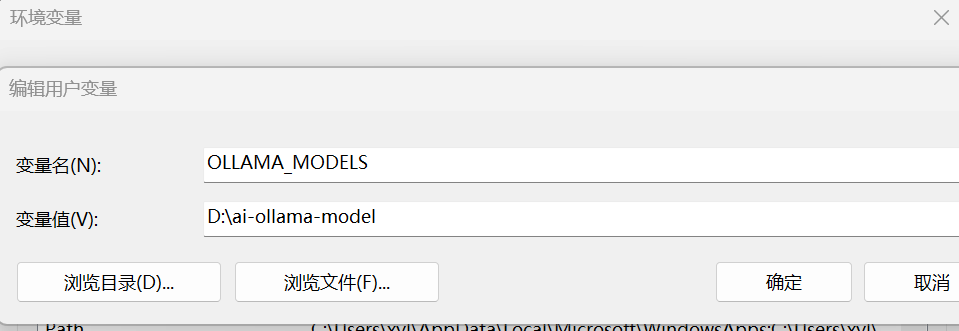
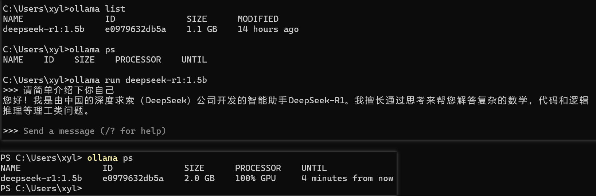
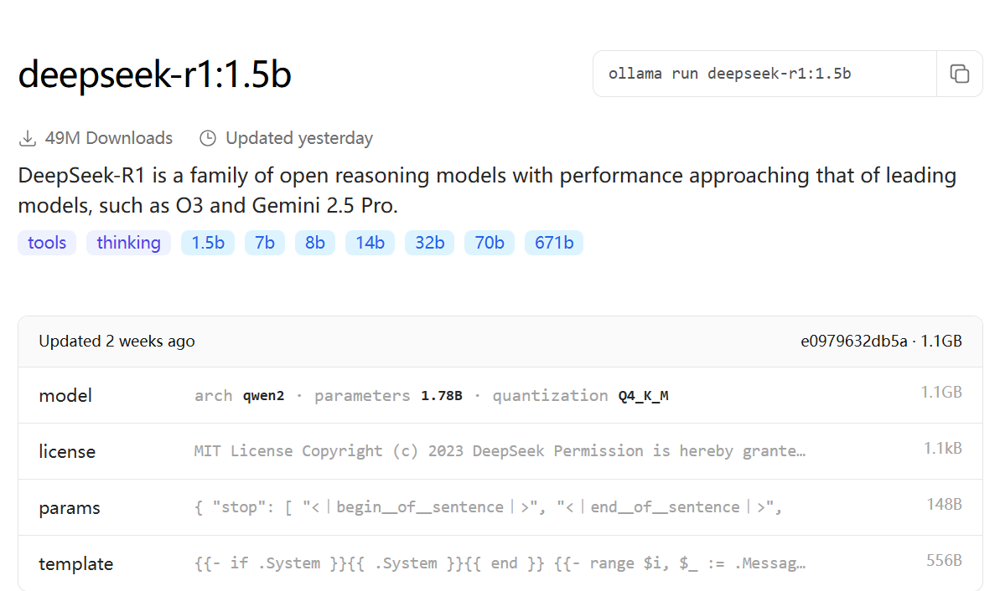

# 项目介绍
迅磊AI应用平台,整合多个AI智能体,为特定领域和功能提供专业的解答

# 项目启动说明
## Ollama大模型本地部署
ollama是一个模型管理工具和平台,它提供了很多国内外常见的模型,可在其官网上搜索自己需要的模型:
- 1) 下载ollama客户端,https://ollama.com/
 Ollama默认安装目录是C盘的用户目录，如果不希望安装在C盘的话,可在本地OllamaSetup.exe所在目录打开cmd命令行，执行如下命令:
```bash
OllamaSetup.exe /DIR=你要安装的目录位置
```
配置环境变量(像配置Java环境变量一样)
```bash
变量名(N): OLLAMA_MODELS
变量值(V): 你想要保存模型的目录
```
示例如下:


2) 下载并启动 deepseek-r1大模型,命令如下:
```bash
ollama run deepseek-r1:1.5b 
```
如果之前没有下载过对应大模型,则会去官网下载并启动,如果下载过,则会直接启动大模型



上图中的1.5b、7b、8b、14b、32b、70b、671b,是模型的参数大小，越大推理能力就越强，需要的算力也越高

3) 引入依赖:
```xml
<dependency>
  <groupId>org.springframework.ai</groupId>
  <artifactId>spring-ai-ollama-spring-boot-starter</artifactId>
  <version>1.0.0-M6</version>
</dependency> 
```
4) 大模型在yaml中的配置:
```yaml
spring:
  ai:
    ollama:
      base-url: http://localhost:11434
      chat:
        model: deepseek-r1:1.5b
```

补充:
- 1) Ollama是一个模型管理工具,比较像 Docker,常用命令如下:
```bash
  ollama serve      # Start ollama
  ollama create     # Create a model from a Modelfile
  ollama show       # Show information for a model
  ollama run        # Run a model
  ollama stop       # Stop a running model
  ollama pull       # Pull a model from a registry
  ollama push       # Push a model to a registry
  ollama list       # List models
  ollama ps         # List running models
  ollama cp         # Copy a model
  ollama rm         # Remove a model
  ollama help       # Help about any command
```
2) ollama run命令启动大模型,出现如下报错:
```bash
Error: listen tcp 127.0.0.1:11434: bind: Only one usage of each socket address (protocol/network address/port) is normally permitted.
```
报错原因是: Ollama 服务没办法在本地的 11434 端口上启动，原因是这个端口已经被其他程序占用了
解决方案: 找到占用端口的进程后 kill掉 或 使用其他端口
```bash
# 查看占用 11434 端口的程序
netstat -ano | findstr :11434

# 根据输出的 PID（最后一列数字）结束进程
taskkill /F /PID <PID>
```
或使用其他端口启动
```bash
ollama serve --port 11435
```

